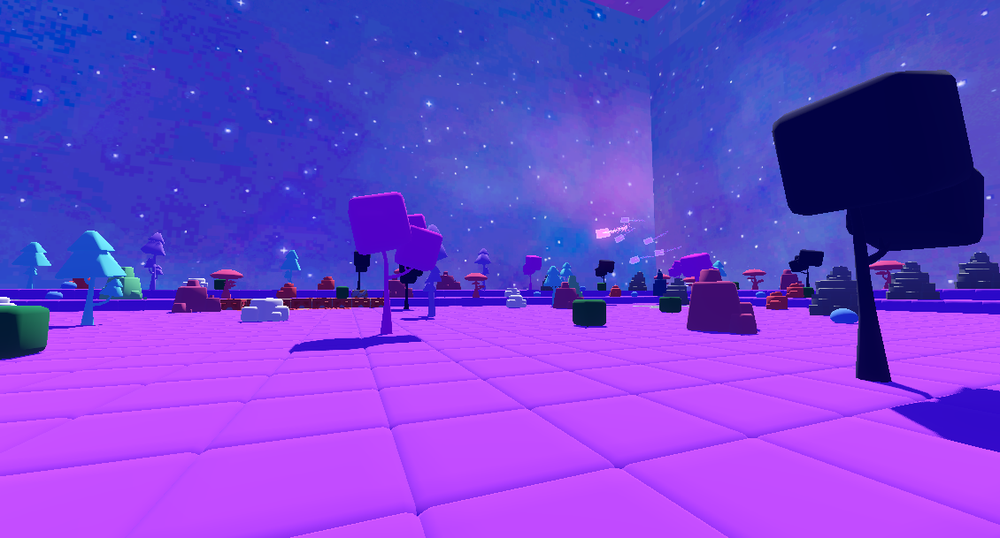
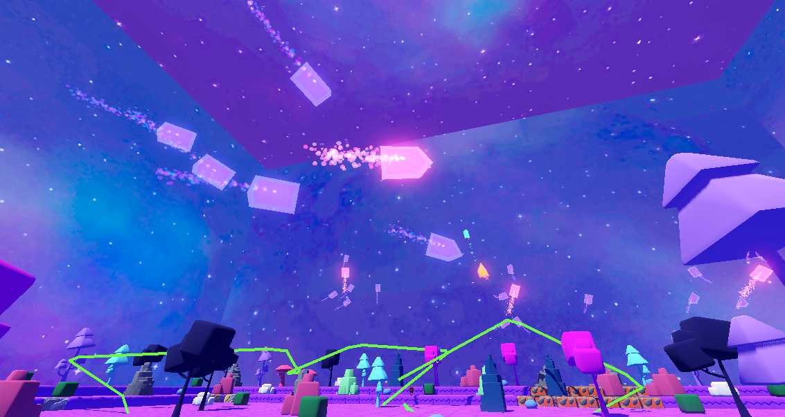
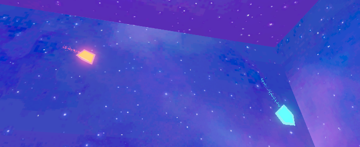
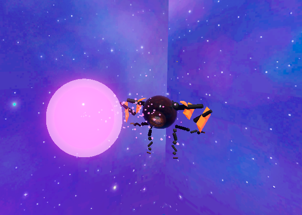
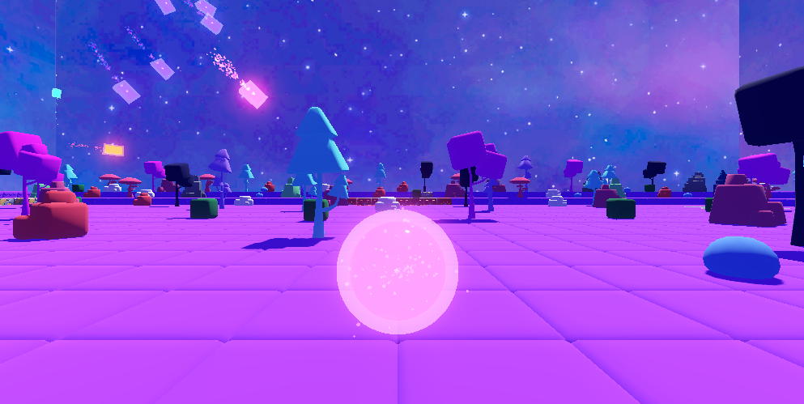

# 👁️ Floating Eye

## Project Description

The game is set in a **space environment** featuring a floating island on a desolate planet named **EB-2**.

The main autonomous agent (boid) is a **floating eyeball with wings and legs** called Kraken.

### Eyeball Behavior

- Floats around the environment
- Follows predefined paths
- Avoids obstacles such as:
  - Trees
  - Rocks
- Eyeball picks up the ball that the user throws in the environment

### Audio Interaction

- Various sounds and audio effects play depending on the player's position relative to the eyeball.
- An audio clip is triggered when the player gets close to the eyeball.

### Additional Background Behavior

There will be:

- A **leader Space Bee**
- Smaller follower eyeballs that follow the leader

- A **Predator Space Bee and Prey Space Bee**
- If Predator is near prey it will start to chase the prey, the prey will then flee, if the prey flees too far the predator will give up and change using state machines to the wander behaviour.

This behavior exists in the background and is separate from the main autonomous eyeball agent.

---

## 👥 Team Members

### Denis

- **Student ID:** C22503876
- **Course:** TU857 (4)
- **GitHub:** [denisbajgora5](https://github.com/denisbajgora5)

### Jason

- **Student ID:** C22400796
- **Course:** TU856 (4)
- **GitHub:** [JasonOS03](https://github.com/JasonOS03)

---

## 🎥 Video

## link

## 🖼️ Screenshots

Image 1: Screenshot of the map

Image 2: Leader and follower boid screenshots

Image 3: Predator and Prey boid screenshots

Image 4: Image of the main Kraken Eye boid

Image 5: Image of the ball that the user throws.

---

## 🎮 Instructions for Use

### First Person Mode

1. Open the project in **Godot 4.x**
2. Load the main scene: `scenes/main.tscn`
3. Left click to capture the mouse. Press `Esc` to release it.
4. Use `WASD` or the Arrow Keys to move, `Space` to jump, and `Shift` to sprint.
5. Press `` ` `` to toggle freefly mode.
6. Press `G` to toggle steering gizmos and `H` to toggle the floating eye path display.
7. press E to throw and pick up the ball.

---

## ⚙️ How It Works

- **`scripts/main.gd`**  
  Handles scene-level debug controls. It hides the boid gizmos and floating-eye path at startup, toggles gizmos with `G`, toggles the path mesh with `H`, and keeps the on-screen debug label in sync.

- **`scripts/proto_controller.gd`**  
  Runs the first-person player controller. It manages mouse look, walking, jumping, sprinting, freefly mode, and the fall reset that teleports the player back to the center of the map if they drop too far below the level.

- **`scripts/boid.gd`**  
  Base steering class for autonomous agents. It collects child steering behaviours, sums their weighted forces, limits the final steering force, applies damping and banking, then moves the boid with `move_and_slide()`.

- **`scenes/follow_path.gd`**  
  Makes the main floating eye follow a `Path3D` by targeting one waypoint at a time and advancing to the next point when the current point is reached.

- **`scripts/behaviours/avoidance.gd`**  
  Provides obstacle avoidance using multiple ray probes. When a probe hits something, it generates sidestep, braking, and recovery forces so the boid can steer around the obstacle instead of colliding with it.

- **`scripts/behaviours/alignment.gd`, `cohesion.gd`, `separation.gd`**  
  Implement the classic flocking rules used by the background followers: align with neighbors, move back toward the group center, and push away when too close.

- **`scripts/behaviours/offSetPursue.gd`**  
  Keeps follower bees in formation with a leader by storing an offset from the leader and predicting where that offset will be as the leader keeps moving.

- **`scripts/behaviours/predator.gd` and `scripts/prey.gd`**  
  Control the predator/prey background interaction. The predator swaps between wandering and chasing based on distance, while the prey adds a panic flee force when the predator gets too close.

- **`scripts/eye_kraken_1.gd` and `scripts/kraken_eye_visual_controller.gd`**  
  Control the main Kraken eye boid and its presentation. These scripts update the debug label, drive movement using steering forces, play leg animations when grounded, and flap the wings while airborne.
  
- **`scripts/top_left_hud.gd`**
  Controls the top left corner of the UI. It sets the text to be a particular font size and color aswell as font type.
  
- **`scripts/fps.gd`**
  - displays the current frames per second.
---

## 📦 Classes & Assets

| Class / Asset | Purpose in Project | Source |
| --- | --- | --- |
| `scripts/main.gd` | Main scene controller for debug toggles, gizmo visibility, and the floating-eye path display. | Self written (ChatGPT assisted) |
| `scripts/proto_controller.gd` | First-person player controller with walking, jump, sprint, freefly, and fall-reset respawn logic. | Based on Brackeys Proto Controller, then extended for this project |
| `scripts/boid.gd` | Shared steering/movement base for autonomous agents. | Self written (ChatGPT assisted) |
| `scripts/leader.gd` | Leader boid used by the background space-bee formations. | Self written (ChatGPT assisted) |
| `scripts/behaviours/follower.gd` | Shared follower movement base used by escort bees, predator, and prey. | Self written (ChatGPT assisted) |
| `scenes/follow_path.gd` | Steering behaviour for following a `Path3D`. | Self written (ChatGPT assisted) |
| `scripts/behaviours/avoidance.gd` | Raycast-based obstacle avoidance for boids. | Self written (ChatGPT assisted) |
| `scripts/behaviours/alignment.gd`, `cohesion.gd`, `separation.gd` | Flocking behaviours for swarm motion. | Self written (ChatGPT assisted) |
| `scripts/behaviours/offSetPursue.gd`, `pursue.gd`, `arrive.gd`, `flee.gd`, `wander.gd` | Core steering behaviours used across the AI agents. | Self written (ChatGPT assisted) |
| `scripts/behaviours/predator.gd` and `scripts/prey.gd` | Distance-based predator/prey AI for the background encounter. | Self written (ChatGPT assisted) |
| `scripts/eye_kraken_1.gd` and `scripts/kraken_eye_visual_controller.gd` | Main floating-eye movement and animation control. | Self written (ChatGPT assisted) |
| `scenes/map.tscn` and `mesh_library.tres` | GridMap terrain layout and reusable environment tiles. | Built in-project using KayKit BlockBits assets |
| `scenes/boids/krakenEye.tscn` | Main autonomous eye scene. | Built in-project using the Sketchfab eye model |
| `assets/skybox/nebula/*` | Space skybox textures used by the `WorldEnvironment`. | Jettelly space skybox pack |
| `addons/debug_draw_3d` | Debug drawing tools for steering vectors, neighbor ranges, and avoidance probes. | External Godot addon |

---

## 📚 References

### AI Prompts

- How to make the boid follow a path.
- How to set s color for a mesh.
- How does avoidance work?
- Can you suggest a design for the background boids.
- Whats a good particle effect for a boid?
- Should the floating eye boid have a cool particle effect?
- How to make a floating eye follow a path.
- How to set ponits around the map using path follow 3d
- why does my floating boid go around in a circle.
- Why does my floating boid go into the air and never come back.
- Why does the floor model look glitchy.
- How do i fix the predator and prey keep bashing into walls.
- So how to make the leader boid not go into the tree.
- generate the code to change the text color, font and font size of the text in the top left corner
- make the leg and wing animations work correctly

---

## 🧊 Models

- **KayKit Asset Packs BlockBits:** https://kaylousberg.itch.io/block-bits

- **Floating Eye:**
  https://sketchfab.com/3d-models/kraken-eyeball-blender-file-9af20edc176c460391d1948356c339b7

- **Map SkyBox:**  
  https://jettelly.com/blog/some-space-skyboxes-why-not

- **First Person Controller:**  
  https://github.com/Brackeys/brackeys-proto-controller

---

## 🔊 Sound Effects

- **Background Music:**  
  https://freesound.org/people/ZHR%C3%98/sounds/572358/

- **Background SFX for Floating Eye:**  
  https://freesound.org/people/DylanTheFish/sounds/442181/

---

## ⭐ What We’re Most Proud Of

- **Denis:**  
  I am most proud of the following features:
  background boids the way they avoid obsucles.
  The way the wonder around and do their own thing using Wander was really cool to implement.
  I am really proud of the way the map turned out it fits really nicely with the sky box.
  The way the boids are neon like and have particles i am super proud of as it makes them glow really nicely in the sky.
  I Am also proud of the way i designed the colors of the map and boids the way it looks like an alien planet.
  The music aswell i am super proud of as it fits the game very nicely espically the background music and floating eye SFX.

- **Jason:**  
  I am most proud of my implementation of the behaviours of the main eyeball boid.
  Getting FollowPath to work with the main boid in particular is something I am very proud of, as the FollowPath script as well as the path itself required lots of modifications to get fully working.
  I am also proud of how I implemented the other behaviours such as seek, where the boid can follow a target as well as Avoidance on the main eyeball. The main eyeball moves around any object in the environment or other boids it comes into contact with.
  I am proud of the animations I created using AnimationPlayer3D for the legs of the main boid. I am also proud of the Particle effect used on the main boid through GPUParticles3D node.
  Finally I am proud of how I implemented various aspects of the environment such as the ground.

---

## 📖 What We Learned

- **Denis:**  
  I learnt more about Gridmap how to use it how to use mesh library importing models from a online source. How to use buses to control different sound enviorments. I learnt about wandering, seek, how to animate wingss for the eye. I learnt how seperation, cohension and alignement work along with avoidance. Also, i learnt how the weights work together if a weight is too small it could lead to it other weights taking priority.

- **Jason:**  
  I learned A lot about how the FollowPath and Path3D nodes work and how they can be implemented into Godot Projects. I also learned how to effectively use the  AnimationPlayer3D node to create high quality animations which can be attached to the various aspects of the character body, which is the boid in this case. I Learned how to effectively implement behaviours such as seek, arrive and avoidance and how to tweak the priorities of these behaviours to get the desired movement. I also learned how to create floors using the imported blockbits`package.

---

_Thank you for exploring the Floating Eye!_ 👁️🌑

**Autonomous Agent Assignment Proposal (OG Proposal)**

# Games Engines 2 — Autonomous Agent

## Project Proposal

## Project Title

**Wandering Eye: A Walking Floating Autonomous Eyeball**

---

## Team Members

- Jason O’Sullivan (C22400796)
- Denis Bajgora (C22503876)

---

## Development Environment

- Local development
- Godot Engine (Godot Editor used for running the game)
- No XR used

---

## GitHub Repository

https://github.com/denisbajgora5/floating-eye

---

## GitHub Branches

- `main`
- `denis-branch`
- `jason-branch`

---

## Player

The player is represented as a **first-person character**.

### Controls

- **Keyboard:** WASD or Arrow Keys
- **Controller:** Supported

### Abilities

- Move
- Jump
- Fly
- Run

The player’s purpose is to observe the floating eye and its autonomous behaviors within the environment.

---

## Project Description

The game is set in a **space environment** featuring floating islands on a desolate planet named **EB-2**.

The main autonomous agent (boid) is a **floating eyeball with wings and legs**.

### Eyeball Behavior

- Floats around the environment
- Follows predefined paths
- Avoids obstacles such as:
  - Trees
  - Space base structures
- Lands and transitions into crawling behavior
- Crawls along:
  - Ground
  - Walls
  - Environmental objects
- Interacts with environmental objects

### Audio Interaction

- Various sounds and audio effects play depending on the player's position relative to the eyeball.
- An audio clip is triggered when the player gets close to the eyeball.

### Additional Background Behavior

There will be:

- A **leader eyeball**
- Smaller follower eyeballs that follow the leader

This behavior exists in the background and is separate from the main autonomous eyeball agent.

---

## Components Used

The following Godot nodes and systems will be used:

- **Path3D** and **PathFollow3D**  
  → For path-following behavior

- **CharacterBody3D**  
  → Used for both the player and the eyeball

- **CollisionShape3D**  
  → For physics and collision detection

- **MeshInstance3D**  
  → For visual representation

- **Node3D** and **Node**  
  → For grouping and scene structure

- **AnimationPlayer**  
  → For animations such as:
  - Wing fluttering
 
  - **GPUParticles3D**
    - used for adding a particle effect to the main boid and the background follower and leader boids

---

## Steering Behaviors

The eyeball's movement will be controlled using steering behaviors.

### Implemented Behaviors

- Seek
- Arrive
- Pursue
- Offset Pursue
- Wander

### State Machines

State Machines will manage behavior transitions.

For example:

- If the eyeball gets close to the space base, it will switch to an avoidance behavior.
- Behaviors can dynamically change depending on environmental triggers.

---

## Signals

Godot **signals** will be used to:

- Trigger behavior changes
- Detect environmental interactions
- Switch states when encountering specific objects

---

## Summary

_Wandering Eye_ is an autonomous agent project showcasing steering behaviors, state machines, and interactive environmental AI within a 3D Godot space environment. The player observes the emergent behavior of the floating eyeball and its interactions with the world.
